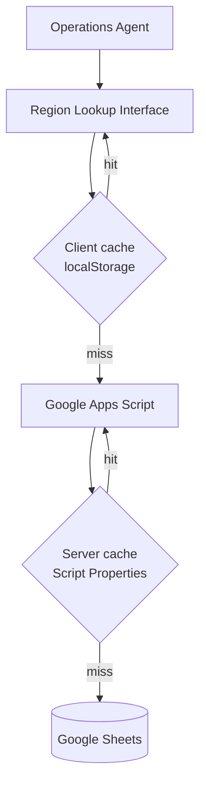

# 🌎 Region Lockup

  
  
  
  
  

> A centralized decision-support platform that lets operations agents retrieve
> market-specific **compliance, onboarding, and eligibility requirements** across
> the US and Canada — with a **single region code**.

| 📊 Production adoption | |
|---|---|
| Weekly active users | **250+** |
| Weekly executions | **Thousands** |
| Error rate | **0.03%** |
| Markets covered | 🇺🇸 US · 🇨🇦 Canada |
| Status | In production, actively used by operations teams |

## 🖼 Screenshots

**Search interface** — one region code in, everything out:

**Region results** — unified market profile:

**Comparison mode** — regions side-by-side:

## 🧩 The Problem

Before Region Lockup, agents answered questions like *"Is this vehicle eligible in this market?"*,
*"What inspection is required?"*, *"What's the minimum driver age?"* by searching across
documentation repositories, spreadsheets, help-center articles, and regional guides.

That process was:
- ⏱ Time-consuming
- 🔀 Prone to inconsistencies
- 🧠 Dependent on agent experience
- 📈 Difficult to scale

## ✅ The Solution

Agents enter a region code and instantly receive a unified market profile:

- Market & state/province information · region classification
- Vehicle & driver eligibility requirements
- Insurance, inspection & driving-history requirements
- Regional onboarding requirements
- Current local time in the driver's market

## ✨ Key Features

| Feature | What it does |
|---|---|
| 🔎 Instant region search | One code → full market profile |
| ⚖️ Compliance lookup | Market-specific onboarding & compliance requirements |
| 🚗 Vehicle eligibility | Market age limits & restrictions |
| 🪪 Driver eligibility | Minimum age & driving-history rules |
| 🛡️ Insurance & inspection | Per-region requirements |
| ⚖️ Comparison mode | Multiple regions side-by-side |
| 🕐 Real-time local clock | Live time for US & Canadian regions |
| 💡 Autocomplete | Intelligent search suggestions |
| 📣 Feedback loop | Built-in feedback collection for continuous improvement |
| ⚡ Caching layer | Server-side (Script Properties) + client-side (localStorage) |

## 💼 Impact

- Reduced lookup effort and handling time
- Faster, more consistent decision-making across agents
- Centralized knowledge — reduced reliance on institutional memory
- Stronger onboarding support for new agents

## 🛠 Technology Stack

| Layer | Technology |
|---|---|
| Frontend | HTML5 · CSS3 · JavaScript |
| Backend | Google Apps Script |
| Data | Google Sheets |
| Caching | Script Properties (server) · localStorage (client) |
| Extras | Autocomplete engine · comparison engine · timezone conversion · feedback workflow |

## 🏗 Architecture

## 📜 Version History

| Version | Highlights |
|---|---|
| 2.0 | Autocomplete, feedback system, server/client caching, enhanced UI |
| 1.5 | Region comparison, live timezone display |
| 1.0 | Initial market eligibility & compliance lookup |

## 🔒 Confidentiality Notice

This platform was developed for internal organizational use. Source code, production
datasets, business rules, operational documentation, integrations, and connected
resources are intentionally excluded from this repository due to confidentiality
requirements. Screenshots have been redacted to protect proprietary information.

This repository showcases the **business problem, solution design, architecture, and
measurable operational impact** of the platform.

---

<b>🌎 Region Lockup</b> <i>One code. Every answer.</i>

